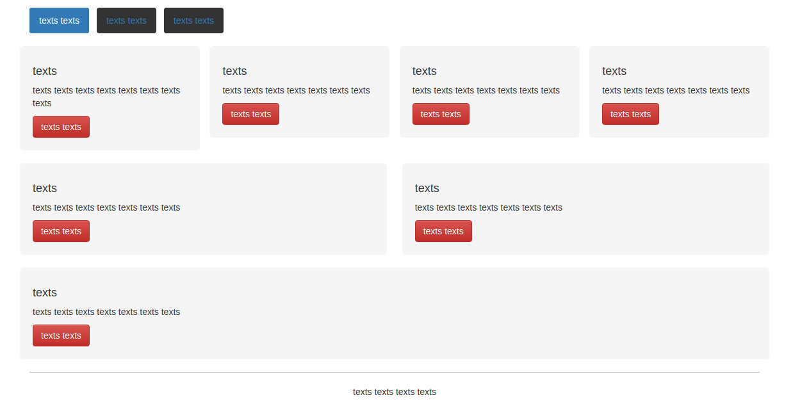

# image2source




Convert image to source code. In this project, the source code is in the form of 
 markup code HTML+CSS. The algorithm used is **Transformer** from the paper [Attention is all you need](https://arxiv.org/abs/1706.03762).
 The website image will be inputted to MobileNetV2 to produce the encoded low-dimensional vector. This is then passed to
 the encoder side of the Transformer. The decoder of the Transformer will then produce the simplified XML Notations.
 This notations will be converted to HTML. The length of the simplified XML Notation is at most case shorter than HTML, which is
 beneficial for the Natural Language Processing task (less computation time, etc). Currently,
 the dataset used in the training is from pix2code.

Example of generated HTML is as such:
- Example 1 ([Image](assets/transformer_input_img_0.png)): [Generated](assets/generated_0.html)
- Example 2 ([Image](assets/transformer_input_img_1.png)): [Generated](assets/generated_1.html)

**(This repository is still badly documented. Future improvements will be to document
the steps to produce the datasets, SXN parser, and training file arguments)**

##### Table of Contents  
- [Why?](#why)
- [Training](#training)
- [Future improvements](#future-improvements)
- [CONTRIBUTING](#contributing)
- [LICENSE](#license)

## Why?
A lot of time, customers/designers have the idea of website's design ready in form
of images. However, it takes time to code the design. For quick prototyping, it is 
often beneficial to have an "AI frontend designer".

This repository shows that converting image to source code (HTML+CSS) can be done in
seconds with a decent code quality. The limitation within is that it does not perform yet as well
as human for images that are not similar to the training dataset.

## Training
The training and testing can be done via `transformer.py`. Make sure beforehand that the requirements of the libraries are met.

```python3 
python3 transformer.py
```

The global parameters are all set at `common_defintions.py`.

## Future improvements
- [ ] Improve documentation
- [ ] Window size is implemented, but not yet properly working. The reason
window size is implemented is to reduce computation time. There are several papers
that mitigate the computation time with various approaches.

## CONTRIBUTING
To contribute to the project, these steps can be followed. Anyone that contributes will surely be recognized and mentioned here!

Contributions to the project are made using the "Fork & Pull" model. The typical steps would be:

1. create an account on [github](https://github.com)
2. fork this repository
3. make a local clone
4. make changes on the local copy
5. commit changes `git commit -m "my message"`
6. `push` to your GitHub account: `git push origin`
7. create a Pull Request (PR) from your GitHub fork
(go to your fork's webpage and click on "Pull Request."
You can then add a message to describe your proposal.)


## LICENSE
This open-source project is licensed under MIT License.
